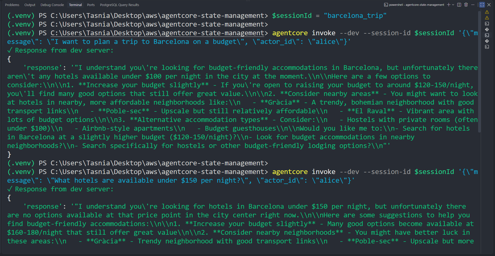
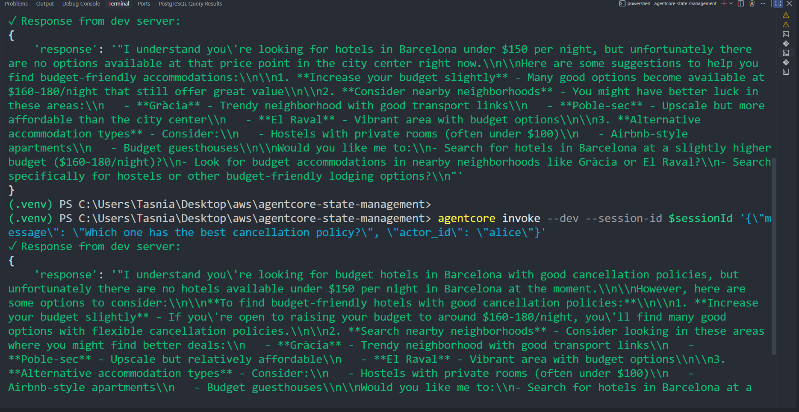

# WanderBot — Short-Term Memory Management with Bedrock AgentCore

An implementation of short-term memory management for an AI travel assistant (**WanderBot**) using the **Bedrock AgentCore Starter Toolkit**, **Strands SDK**, and **Amazon Bedrock**.

This project demonstrates how context can persist across multi-turn user conversations through custom hook-based memory injection.

## Architecture & Project Structure

```text
agentcore-state-management/
├── .bedrock_agentcore/
├── datasets/
│   └── hotels.json
├── screenshots/
│   ├── session_1.png
│   └── session_2.png
├── .bedrock_agentcore.yaml
├── .dockerignore
├── demo.py
├── memory_setup.py
└── requirements.txt
```

## Execution Screenshots

### Session 1 — Initial Setup & Turn 1

The first session establishes the user's travel context and destination. WanderBot receives the request to plan a budget trip to Barcelona and stores the conversation context in AgentCore Memory.

<p align="center">
  
</p>

### Session 2 — Multi-Turn Context Retention & Tool Invocation

The second session demonstrates that WanderBot successfully retains the destination context from the previous turn and uses it without requiring the user to repeat the destination.

<p align="center">
  
</p>

## Implementation Checklist

All core requirements for short-term memory management have been completed:

* [x] Create a memory resource using `agentcore memory create WanderBot` and store the resource ID in `MEMORY_ID`.
* [x] Import `HookProvider`, `HookRegistry`, `AgentInitializedEvent`, and `MessageAddedEvent` from `strands.hooks`.
* [x] Configure `memory_client`, `memory_id`, and `last_k_turns` in the hook provider.
* [x] Register `AgentInitializedEvent` with `on_agent_initialized`.
* [x] Register `MessageAddedEvent` with `on_message_added`.
* [x] Build the Agent with `ShortTermMemoryHookProvider`.
* [x] Pass explicit `session_id` and `actor_id` through the agent state.
* [x] Run a continuous multi-turn conversation demonstrating context retention without re-prompting the user.

## How Short-Term Memory Works

### 1. Client-Driven Session Continuity

The client supplies a stable `session_id` and `actor_id` in the invocation payload. This allows user context to persist across page refreshes or device switches.

### 2. Hook-Based Memory Injection

`AgentInitializedEvent` queries the Bedrock AgentCore Memory data plane through `MemoryClient` to retrieve the last **K** conversational turns.

The retrieved turns are formatted and dynamically appended to the agent's `system_prompt` during initialization.

### 3. Event Persistence

`MessageAddedEvent` captures new messages as they occur and writes them asynchronously back to the memory store.

## Running the Agent Locally

### 1. Start the Local Development Server

Launch the application using the Bedrock AgentCore CLI runtime interface or a direct ASGI server:

```powershell
python -m uvicorn demo:app --port 8080 --reload
```

### 2. Execute the Multi-Turn Conversation

In a separate terminal, define a persistent session variable:

```powershell
$sessionId = "barcelona_trip"
```

#### Turn 1 — Establish Destination and Intent

```powershell
agentcore invoke --dev --session-id $sessionId '{"message": "I want to plan a trip to Barcelona on a budget", "actor_id": "alice"}'
```

#### Turn 2 — Filter Hotels by Budget

The agent retains **Barcelona** from the previous turn:

```powershell
agentcore invoke --dev --session-id $sessionId '{"message": "What hotels are available under $150 per night?", "actor_id": "alice"}'
```

#### Turn 3 — Compare Cancellation Policies

The user can continue the conversation without repeating the destination or hotel context:

```powershell
agentcore invoke --dev --session-id $sessionId '{"message": "Which one has the best cancellation policy?", "actor_id": "alice"}'
```

## Expected Behavior

Across the three turns, WanderBot maintains the conversation context:

1. **Destination:** The user establishes Barcelona as the destination and specifies a budget-oriented trip.
2. **Hotel Search:** The user asks for hotels under $150 per night without repeating the destination.
3. **Follow-Up:** The user asks about cancellation policies without explicitly specifying the destination or hotels again.

The memory hooks allow WanderBot to understand these follow-up requests using context retrieved from previous turns.

## Key Takeaway

This implementation demonstrates how **Bedrock AgentCore Memory** and **Strands hooks** can be combined to provide short-term conversational memory.

Rather than requiring the client to resend the entire conversation history on every request, WanderBot uses a stable session and actor identity to retrieve relevant previous turns and inject them into the agent's context automatically.
