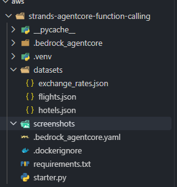
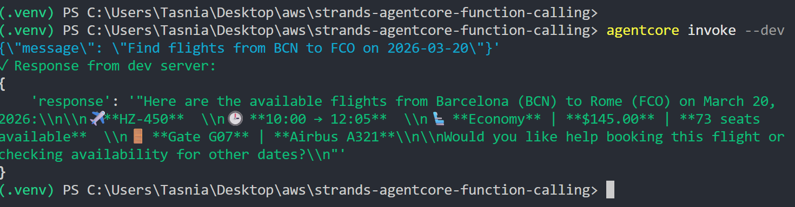
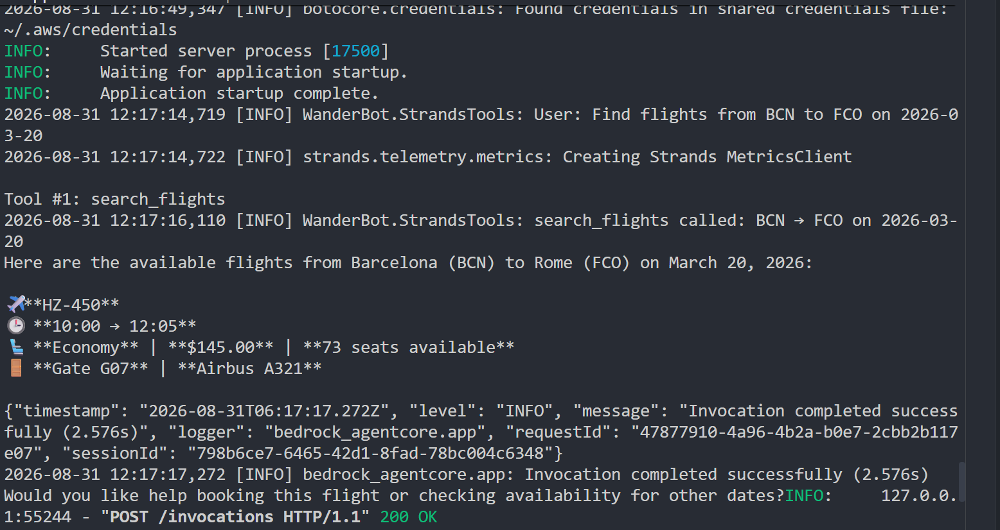

# strands-agentcore-function-calling

WanderBot is a travel assistant agent built with the Strands SDK and deployed on Amazon Bedrock AgentCore Runtime. It answers questions about flights, hotels and currency conversion by calling ordinary Python functions that read from local JSON files in `datasets/`, with no external APIs involved. The exercise is about function calling: exposing plain functions as tools, and writing the docstrings that tell the model which of them to select and what arguments to pass.

## Tools

The agent is given four tools. One is built in, three are custom functions defined in `starter.py`.

`current_time` is imported from `strands_tools` and passed straight into the agent's `tools` list. It supplies the current date and time in UTC, which is what lets the agent resolve relative dates before it calls anything else.

```python
@tool
def search_flights(origin: str, destination: str, date: str) -> str
```

Reads `datasets/flights.json` and filters for records whose `origin`, `destination` and `date` all match, comparing airport codes case-insensitively and the date as an exact string. It returns a formatted table of the matching flights with `flight_number`, `departure_time`, `arrival_time`, `cabin_class`, `price_usd`, `available_seats`, `gate` and `aircraft`, plus a status marker drawn from `status` (`SCHEDULED`, `DELAYED` or `CANCELLED`). When nothing matches it returns a short not-found message suggesting adjacent dates rather than raising.

```python
@tool
def search_hotels(city: str, max_price_usd: float = 9999.0) -> str
```

Reads `datasets/hotels.json` and keeps hotels whose `city` matches, whose `available` flag is true, and whose `price_per_night_usd` is at or below `max_price_usd`. Results are sorted cheapest first and rendered with `name`, `hotel_id`, star rating, price, `room_types`, the first four `amenities`, check-in and check-out times, and `cancellation_policy`. The default of 9999 means an unfiltered query, and the function uses that same value as the threshold for whether to mention a budget in its output.

```python
@tool
def get_exchange_rate(from_currency: str, to_currency: str, amount: float = 1.0) -> str
```

Reads `datasets/exchange_rates.json`, which stores rates against a USD base. The function injects `USD: 1.0` into the rate table at runtime (the file itself lists only the fifteen non-USD currencies) and computes the cross rate by pivoting through USD, so any supported pair works in either direction. It returns the rate, the converted amount, and the `last_updated` date from the file. An unsupported code produces a message listing every code that is accepted.

The docstrings on these three functions are not documentation for human readers. Strands turns each one into the tool schema the model sees, so the docstring is the only thing that tells the model an airport is an IATA code rather than a city name, or that a date has to be ISO formatted. A vague docstring produces wrong arguments or a skipped tool call. This is what `search_flights` declares:

```
    Args:
        origin      : IATA airport code for the departure airport.
                      Examples: 'LHR' (London), 'JFK' (New York), 'BCN' (Barcelona),
                      'SYD' (Sydney), 'DXB' (Dubai), 'MIA' (Miami), 'LAX' (Los Angeles)
        destination : IATA airport code for the arrival airport.
                      Examples: 'CDG' (Paris), 'FCO' (Rome), 'NRT' (Tokyo Narita),
                      'LHR' (London), 'MIA' (Miami), 'LAX' (Los Angeles), 'CUN' (Cancun)
        date        : Travel date in YYYY-MM-DD format. Example: '2026-03-15'
```

`search_hotels` does the same job for its optional parameter, stating that `city` must be an exact city name and that `max_price_usd` "defaults to 9999 (no price limit)" with example values of 100, 200 and 300. `get_exchange_rate` names the standard outright, asking for "ISO 4217 source currency code (e.g. 'USD', 'EUR', 'GBP')", and lists all sixteen supported codes above the `Args` block so the model can decline an unsupported pair without a round trip.

## What was implemented

The starter file shipped with five `TODO` markers. All five are now complete.

1. `tool` is imported from `strands` and `current_time` from `strands_tools`.
2. `search_flights` carries the `@tool` decorator and a docstring that pins `origin` and `destination` to IATA codes and `date` to `YYYY-MM-DD`, with worked examples for each.
3. `search_hotels` carries the `@tool` decorator and a docstring covering the required `city` and the optional `max_price_usd`, including what the 9999 default means.
4. `get_exchange_rate` carries the `@tool` decorator and a docstring specifying ISO 4217 codes and enumerating the supported set.
5. The `invoke` entrypoint builds the `Agent` with `model`, `SYSTEM_PROMPT` and all four tools in the `tools` list, in the order `current_time`, `search_flights`, `search_hotels`, `get_exchange_rate`, then calls `agent(user_message)` and returns the result.

The agent is constructed inside `invoke` rather than at module scope, so each request gets a fresh agent with no carried-over conversation state. The model is `us.amazon.nova-2-lite-v1:0`, a cross-region inference profile, wrapped in `BedrockModel`.

## Project structure



```
starter.py                  Agent definition, three @tool functions, entrypoint
requirements.txt            Python dependencies
datasets/
  flights.json              15 flight records
  hotels.json               10 hotel records
  exchange_rates.json       USD-based rates for 15 currencies
screenshots/
  response.png
  server_log.png
  file_tree.png
.dockerignore               Build context exclusions
.venv/                      generated by python -m venv
__pycache__/                generated
.bedrock_agentcore/         generated by agentcore configure (holds the Dockerfile)
.bedrock_agentcore.yaml     generated by agentcore configure
```

The four generated paths do not need to be committed. `.bedrock_agentcore.yaml` in particular records an AWS account ID, an execution role ARN and an absolute path from the machine that ran `configure`.

Dataset paths are resolved against the source file rather than the working directory, so the agent finds `datasets/` whether it is started from the repo root, from somewhere else on disk, or from inside the deployed container where the code lives at `/app`:

```python
BASE_DIR = Path(__file__).resolve().parent
DATA_DIR = BASE_DIR / "datasets"
```

## Setup

Python 3.12 or later. From the repo root in PowerShell:

```powershell
python -m venv .venv
.\.venv\Scripts\Activate.ps1
python -m pip install -r requirements.txt
```

On macOS or Linux the activate line is `source .venv/bin/activate` and the rest is unchanged.

`requirements.txt` lists `strands-agents`, `strands-agents-tools` and `bedrock-agentcore`, unpinned, so a fresh install picks up current versions of all three.

AWS credentials have to resolve through the standard boto3 chain before anything will run. Put an access key and secret in `~/.aws/credentials` under a `[default]` section, and a `region` in `~/.aws/config`. On Windows that is `%USERPROFILE%\.aws\`. Verify with:

```powershell
python -c "import boto3; print(boto3.client('sts').get_caller_identity())"
```

An account and ARN come back if the chain resolved. Nova 2 Lite also needs to be enabled for the account in the Bedrock console under Model access, otherwise the failure arrives at invoke time as an access denied error rather than at startup.

## Configure and run

```powershell
agentcore configure -e starter.py -n WanderBot -dt container -rf requirements.txt --disable-memory -er $ER -ecr $ECR_URI --non-interactive
```

`$ER` is the ARN of the AgentCore execution role and `$ECR_URI` the URI of the ECR repository the image is pushed to. Set both before running the command. Dropping the `-er` and `-ecr` flags along with `--non-interactive` lets `configure` prompt for them and create the resources itself, which is the easier path the first time. The command writes `.bedrock_agentcore.yaml` and `.bedrock_agentcore/WanderBot/Dockerfile`.

Start the local dev server, which listens on port 8080:

```powershell
agentcore dev
```

Leave that terminal running and invoke from a second one:

```powershell
agentcore invoke --dev '{\"message\": \"Find flights from BCN to FCO on 2026-03-20\"}'
```



Prompts the datasets can actually answer, one per tool:

```
Find flights from BCN to FCO on 2026-03-20
Show me hotels in Rome under $200 a night
How much is 500 USD in JPY?
What is the current date and time in UTC?
```

The first matches `HZ-450`, Barcelona to Rome, 10:00 to 12:05, Economy, $145.00, 73 seats, gate G07, Airbus A321. The second matches Hotel Campo de' Fiori at $165 a night, four stars, available, and excludes Hotel de Russie at $490. The third uses the JPY rate of 149.50 against the USD base, giving 74,750.00 JPY. The fourth exercises the built-in tool with no dataset involved.

Coverage is deliberately narrow. Flights run between BCN, DXB, JFK, LHR, MIA and SYD as origins and CDG, CUN, FCO, LAX, LHR, MIA and NRT as destinations, only on the dates 2026-03-15, 03-16, 03-18, 03-20, 03-21 and 03-25. Hotels exist in Barcelona, Tokyo, Rome and Dubai, and one of the ten is marked unavailable. Exchange rates cover EUR, GBP, JPY, AUD, CAD, CHF, SGD, HKD, NZD, SEK, NOK, DKK, AED, THB and MXN against USD. A query outside those bounds gets a clean not-found message, which is correct behaviour but easy to mistake for a broken tool.

## Verifying tool calls

The dev server terminal logs every tool the model selects and the arguments it passed, which is the fastest way to tell whether a docstring is steering it correctly. A successful flight query prints `Tool #1: search_flights`, then the function's own log line `search_flights called: BCN → FCO on 2026-03-20`, then the model's answer, then `Invocation completed successfully` and `POST /invocations HTTP/1.1" 200 OK`.



If the arguments in that log are wrong, a city name where an IATA code belongs or a date in the wrong format, the docstring is what needs fixing, not the function body. If no `Tool #` line appears at all, the model answered from its own knowledge and the docstring failed to convince it a tool was relevant.

The line `Found credentials in shared credentials file: ~/.aws/credentials` appears near the top of the same log on startup and confirms the credential chain resolved. `starter.py` also prints `BASE_DIR=... exists=True` at import, which confirms the dataset directory was located.
