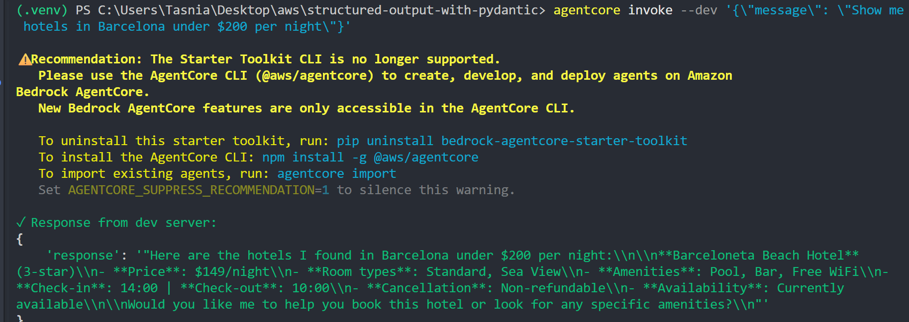
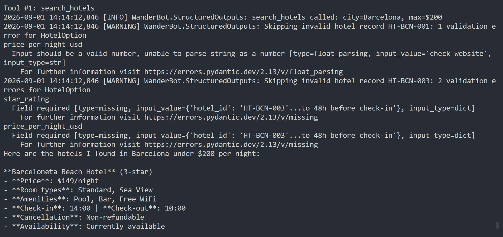

# structured-output-with-pydantic

WanderBot is a travel assistant agent built with the Strands SDK and deployed on Amazon Bedrock AgentCore. This exercise adds Pydantic models between the raw JSON dataset and the agent, so a tool returns a validated, schema-conforming payload rather than whatever shape the file happens to contain. The dataset in `datasets/hotels_broken.json` includes deliberately malformed records, and the point of the lab is watching validation drop them with a specific reason instead of passing bad values through to the model.

## The Pydantic models

Three models are defined in `starter.py`, all on Pydantic v2 (`model_validate` and `model_dump_json` are used, and the runtime errors in the logs link to `errors.pydantic.dev/2.13`).

```python
class HotelSearchInput(BaseModel):
    """Validated input for a hotel search query."""
    city: str = Field(description="Name of the destination city, e.g. 'Barcelona'")
    max_price_usd: float = Field(description="Maximum price per night in USD, e.g. 200.0")
```

`HotelSearchInput` guards the arguments the model chose to pass. Neither field has a default, so both are required at construction. `max_price_usd` is a float, which means a string like `"200"` is coerced and a string like `"cheap"` raises. The tool supplies its own default of 9999.0 before constructing this model, so the required `max_price_usd` is always populated.

```python
class HotelOption(BaseModel):
    """A single validated hotel result."""
    hotel_id: str = Field(description="Hotel identifier, e.g. 'HT-BCN-001'")
    name: str = Field(description="Hotel name, e.g. 'Hotel Casa Marina'")
    city: str = Field(description="City where the hotel is located, e.g. 'Barcelona'")
    star_rating: int = Field(ge=1, le=5, description="Star rating from 1 to 5")
    price_per_night_usd: float = Field(ge=0, description="Price per night in US dollars")
    available: bool = Field(description="Whether the hotel has availability")
    room_types: list[str] = Field(description="Available room types, e.g. ['Standard', 'Deluxe']")
    amenities: list[str] = Field(description="Hotel amenities, e.g. ['Pool', 'Spa']")
    check_in_time: Optional[str] = Field(default=None, description="Check-in time, e.g. '15:00'")
    check_out_time: Optional[str] = Field(default=None, description="Check-out time, e.g. '11:00'")
    cancellation_policy: Optional[str] = Field(default=None, description="Cancellation policy description")
```

`HotelOption` is the model that does the real work. The first eight fields have no default, so a record missing any of them fails with a `missing` error. `star_rating` carries `ge=1, le=5`, which rejects a rating of 0 or 7 as out of range, and being typed `int` also rejects a non-integer value. `price_per_night_usd` carries `ge=0`, which rejects a negative price, and being typed `float` rejects any string that will not parse as a number. `room_types` and `amenities` must be lists of strings, so a bare string in either position fails. The last three fields are `Optional[str]` with `default=None`, so a record that omits `check_in_time`, `check_out_time` or `cancellation_policy` still validates.

```python
class HotelSearchResult(BaseModel):
    """Validated response containing all matching hotels."""
    hotels: list[HotelOption] = Field(description="List of matching hotels")
    total: int = Field(description="Total number of hotels found")
```

`HotelSearchResult` is the envelope the tool actually returns. Because `hotels` is typed as `list[HotelOption]`, the outer object cannot be constructed with anything that did not already validate, and `total` is set from the length of that list rather than from the number of raw records read.

## Tools

The agent is given one tool.

```python
@tool
def search_hotels(city: str, max_price_usd: float = 9999.0) -> str
```

It reads `datasets/hotels_broken.json`, resolved through `BASE_DIR = Path(__file__).resolve().parent` so the path works from any working directory and inside the deployed container. Validation happens in three places.

The arguments go into `HotelSearchInput` first. A `ValidationError` there is caught, logged at error level, and returned to the model as `{"error": "Invalid search parameters", "details": ...}`, so a bad call surfaces as a JSON error rather than an exception.

The raw list is then filtered on `city` (case-insensitively, after `.strip().title()`) and on `available` being true. This filter uses `h.get(...)` on the plain dict, so it runs before any record has been validated.

Each surviving record is passed to `HotelOption.model_validate(h)`. A record that validates is kept only if its `price_per_night_usd` is at or below `max_price_usd`, which is why the price filter is applied to the parsed float rather than the raw JSON value. A record that fails is dropped, and the failure is logged at warning level with the record's `hotel_id` and the full Pydantic error text:

```python
except ValidationError as e:
    logger.warning("Skipping invalid hotel record %s: %s", h.get("hotel_id", "?"), e)
```

Nothing raises out of the tool. The function ends by building a `HotelSearchResult` from the kept records and returning `result.model_dump_json(indent=2)`, so the model receives an indented JSON string with a `hotels` array and a `total` count.

The entrypoint builds the agent per request with `model`, `SYSTEM_PROMPT` and `tools=[search_hotels]`, calls `agent(user_message)`, and returns the result. The model is `us.amazon.nova-2-lite-v1:0` through `BedrockModel`.

## Validation in practice

The dataset holds four records: three in Barcelona and one in Tokyo. All four are marked `"available": true`, so the city and availability filter passes all three Barcelona records through to validation. Only one of them survives.

```powershell
$payload = @{ message = 'Show me hotels in Barcelona under $200 per night' } | ConvertTo-Json -Compress
agentcore invoke --dev $payload
```

The agent answers with Barceloneta Beach Hotel and nothing else.



`HT-BCN-001`, Hotel Casa Marina, is complete apart from one field. Its `price_per_night_usd` holds the string `"check website"`, and `HotelOption` types that field as a float:

```
[WARNING] WanderBot.StructuredOutputs: Skipping invalid hotel record HT-BCN-001: 1 validation error for HotelOption
price_per_night_usd
  Input should be a valid number, unable to parse string as a number [type=float_parsing, input_value='check website', input_type=str]
    For further information visit https://errors.pydantic.dev/2.13/v/float_parsing
```

`HT-BCN-003`, Gothic Quarter Inn, is missing two required fields. The JSON record has `hotel_id`, `name`, `city`, `available`, `room_types`, `amenities`, `check_in_time`, `check_out_time` and `cancellation_policy`, but no `star_rating` and no `price_per_night_usd`:

```
[WARNING] WanderBot.StructuredOutputs: Skipping invalid hotel record HT-BCN-003: 2 validation errors for HotelOption
star_rating
  Field required [type=missing, input_value={'hotel_id': 'HT-BCN-003'...to 48h before check-in'}, input_type=dict]
    For further information visit https://errors.pydantic.dev/2.13/v/missing
price_per_night_usd
  Field required [type=missing, input_value={'hotel_id': 'HT-BCN-003'...to 48h before check-in'}, input_type=dict]
    For further information visit https://errors.pydantic.dev/2.13/v/missing
```



`HT-BCN-002`, Barceloneta Beach Hotel, validates: `star_rating` 3, `price_per_night_usd` 149.00, room types Standard and Sea View, amenities Pool, Bar and Free WiFi, check-in 14:00, check-out 10:00, non-refundable. 149.00 is at or below the 200 ceiling, so it is the single entry in the returned `hotels` array and `total` comes back as 1.

The Tokyo record, `HT-TYO-001`, validates as well but never reaches that stage, since the city filter excludes it before validation runs.

What this buys is the difference between an incomplete answer and a wrong one. Without the model, `"check website"` reaches the agent in the `price_per_night_usd` position of a hotel record, and the price comparison either throws inside the tool or, worse, is skipped and the model presents Hotel Casa Marina as a match for "under $200" on the strength of a string it cannot evaluate. Missing fields behave the same way: Gothic Quarter Inn has no price at all, and an unvalidated pipeline hands the model a hotel with a price-shaped hole in it. Validation converts both into a logged skip and an answer that lists one hotel accurately.

## Project structure

```
starter.py                  Pydantic models, the search_hotels tool, entrypoint
requirements.txt            Python dependencies
datasets/
  hotels_broken.json        4 hotel records, 2 of them deliberately malformed
screeshots/
  agent_reply.png
  log_taht_shows_invalid_hotels_being_removed.png
.dockerignore               Build context exclusions
.venv/                      generated by python -m venv
__pycache__/                generated
.bedrock_agentcore/         generated by agentcore configure (holds the Dockerfile)
.bedrock_agentcore.yaml     generated by agentcore configure
```

The screenshots directory is spelled `screeshots` on disk, and the log filename has a typo in it. Both are used verbatim above so the image links resolve.

The four generated paths do not need to be committed. `.bedrock_agentcore.yaml` in particular records an AWS account ID, an execution role ARN, an ECR repository URI and an absolute path from the machine that ran `configure`.

## Setup

Python 3.12. The lab was first attempted on 3.14, where parts of the dependency stack have no prebuilt wheels and fall back to source builds that fail, so 3.12 is the tested version.

```powershell
python -m venv .venv
.\.venv\Scripts\Activate.ps1
python -m pip install -r requirements.txt
```

On macOS or Linux the activate line is `source .venv/bin/activate`.

`requirements.txt` lists `strands-agents`, `strands-agents-tools`, `bedrock-agentcore` and `pydantic`, all unpinned, so a fresh install picks up current versions. The Pydantic in use when the screenshots were taken was 2.13, which is what the error URLs in the log reflect.

AWS credentials have to resolve through the standard boto3 chain. Put the keys in `~/.aws/credentials` under a `[default]` section and a `region` in `~/.aws/config`. On Windows that directory is `%USERPROFILE%\.aws\`. Verify with:

```powershell
python -c "import boto3; print(boto3.client('sts').get_caller_identity())"
```

An account and ARN come back if the chain resolved. Nova 2 Lite also has to be enabled for the account in the Bedrock console under Model access, otherwise the failure arrives at invoke time as an access denied error.

## Configure and run

Configure once:

```powershell
agentcore configure -e starter.py -n WanderBot -dt container -rf requirements.txt --disable-memory --non-interactive
```

`-er` takes the ARN of an existing AgentCore execution role and `-ecr` the URI of an existing ECR repository. Omitting both, as above, lets `configure` create them. The command writes `.bedrock_agentcore.yaml` and `.bedrock_agentcore/WanderBot/Dockerfile`.

Start the local dev server, which listens on port 8080:

```powershell
agentcore dev
```

Leave that terminal running and invoke from a second one:

```powershell
$payload = @{ message = 'Show me hotels in Barcelona under $200 per night' } | ConvertTo-Json -Compress
agentcore invoke --dev $payload
```

The single quotes inside the hashtable matter. In a double-quoted PowerShell string, `$200` is parsed as a variable named `200` and expands to nothing, so the message arrives as "under per night" and the model has no ceiling to filter on. Single quotes keep the literal.

Recent versions of the starter toolkit print a recommendation on every invoke saying the Starter Toolkit CLI is no longer supported and pointing at `@aws/agentcore`. It is informational and the command still runs. Set `AGENTCORE_SUPPRESS_RECOMMENDATION=1` to silence it.

## A note on cloud deployment

`agentcore deploy` was not usable in the environment this lab was run in. On an AWS Academy Learner Lab account, where the caller identity is an assumed `voclabs` role, CodeBuild stops the build during the PROVISIONING phase. The build reports status `STOPPED` rather than `FAILED`, with no error message and no log stream to read. Starting a build directly through boto3, with the toolkit out of the picture, reproduces the same stop, which rules the CLI out as the cause. Everything the exercise teaches is observable through `agentcore dev`, since a local run still calls Bedrock over the network and the validation happens in the tool either way.

## Troubleshooting

### ExpiredToken from any boto3 call

Learner Lab credentials are temporary. The access key begins with `ASIA` and there is an `aws_session_token` alongside it, and the set expires after a few hours. Replace all three lines in `~/.aws/credentials`, not just the key and secret. Do not edit that file in Notepad, which writes a byte order mark and produces `ConfigParseError` on the next read. Use an editor where you can confirm the encoding is UTF-8 without BOM.

### agentcore is not recognised as a command

Each lab folder has its own virtualenv, and the toolkit is installed per environment rather than globally. Run `python -m pip install -r requirements.txt` with the venv active, and add `bedrock-agentcore-starter-toolkit` and `uv` explicitly if the requirements file does not list them.

### uv trampoline failed to canonicalize script path

Every `.exe` in `.venv\Scripts\` fails at once rather than just one, which is the giveaway. The cause is a virtualenv copied or moved between folders. Windows venvs hardcode absolute paths into their launcher shims and cannot be relocated. Delete `.venv` and rebuild it in place. `python -m pip` bypasses the shim in the meantime.

### ModuleNotFoundError: No module named 'uvicorn'

The traceback comes through `multiprocessing.spawn` and the path in it points at a system Python rather than the one in `.venv`. The `--reload` flag runs the server in a subprocess that loses the interpreter. Drop `--reload`, or call the venv interpreter by absolute path. The ASGI application object is the module-level `app` in `starter.py`:

```powershell
.\.venv\Scripts\python.exe -m uvicorn starter:app --host 0.0.0.0 --port 8080
```

`starter.py` also calls `app.run()` under `if __name__ == "__main__"`, so `python starter.py` serves the same thing.

### Dependency install finishing without installing much

On Python 3.14, parts of the stack have no prebuilt wheels and fall back to source builds that fail partway. The symptom is `python -m pip list` showing two or three packages after an install that appeared to complete. Rebuild the environment on 3.12:

```powershell
py -3.12 -m venv .venv
```
